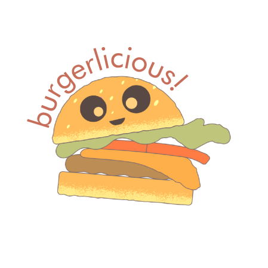
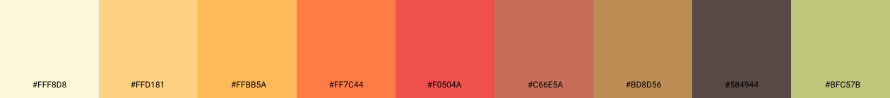
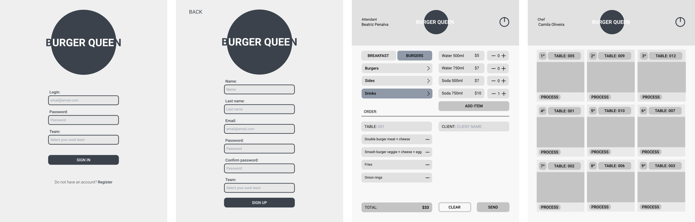
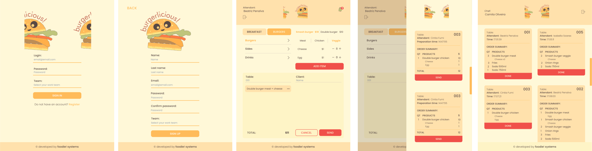

🌟 Uma aplicação Web para gerenciar pedidos em um restaurante. Para acessar [clique aqui!](https://burgerlicious-git-main-cbalieiro.vercel.app/) 🌟 

---
Login para teste:

> **Salão**  
>
> Login - camilaoliveira@burgerlicious.com
> 
> Senha - burguinho

> **Cozinha**  
> 
> Login - biapenalva@burgerlicious.com
> 
> Senha - burguinho

---

## Índice

<p align="center">
 <a href="#-desafio">Desafio</a> •
 <a href="#-introdução">Introdução</a> •
 <a href="#-processo-de-criação">Processo de criação</a> • 
 <a href="#-ferramentas">Ferramentas</a> • 
 <a href="#-créditos">Créditos</a> • 
 <a href="#-como-executar-o-projeto">Como executar o projeto</a> • 
 <a href="#-desenvolvedoras">Desenvolvedoras</a> • 
</p>

---

## Desafio
Olá! 👋 Esse projeto foi desenvolvido em dupla durante o bootcamp da Laboratoria. A [proposta]((https://github.com/Laboratoria/SAP005-burger-queen)) foi desenvolver uma aplicação  gerenciamento de pedidos em uma hamburgueria, priorizando uma interface para tablets, utilizando o React.JS e consumindo uma [API](https://lab-api-bq.herokuapp.com/api-docs/). 💪

---

## Introdução
🍔 A Burgerlicious é uma rede de fast food 24 horas. Devido ao seu sucesso e expansão, a rede precisa de um sistema para ajudar a gerenciar os pedidos dos clientes, facilitando o trabalho e comunicação entre o atendimento no salão e a cozinha.  

💁 👨‍🍳 A interface deve mostrar os dois menus servidos no restaurante, café da manhã e resto do dia, detalhando todos os produtos. O atendimento deve anotar o pedido dos clientes, visualizar em tempo real o resumo do pedido com o custo total e enviar para a cozinha. Essa por sua vez pode avisar ao salão os pedidos que estão prontos para serem servidos.

---

## Processo de criação

📆 **Organização e planejamento**

Esse trabalho foi desenvolvido sob demanda e já recebemos as definições de histórias de usuário do Product Owner, a partir disso o [planejamento](https://trello.com/b/iATzyG7R/burgerlicious-%F0%9F%8D%94) foi organizado seguindo o modelo de Kanban e dividindo uma história de usuário por sprint. No total foram implementadas quatro histórias em quatro sprints de uma semanda cada. A estratégia adotada para escrever o código foi o code review, sendo um dos itens da definição de pronto de cada história. 📋

💡 **Identidade visual**

A paleta de cores foi desenvolvida em tons pastéis com base nas cores dos ingredientes clássicos de um hambúrguer, pão 🍞, carne 🥩, alface 🥬, tomate 🍅 e queijo 🧀. 

A logo escolhida compõe com a estética divertida que os tons pastéis trazem para a marca. 🎨

<p align="center">
  
  
 </p>

⚙️ **Funcionalidades**

##### 1: Cadastro e login
- [x] Funcionários do salão e da cozinha podem se cadastrar na plataforma web fornecendo:
  - [x] nome e sobrenome
  - [x] e-mail
  - [x] senha
  - [x] função
    - salão
    - cozinha  
- [x] Ao concluir o registro com êxito o usuário é redirecionado à página de login
- [x] O login é realizado com e-mail e senha e o funcionário é redirecionado para a página referente à sua função.

##### 2: Criar novos pedidos
- [x] O atendente pode criar novas comandas informando:
  - [x] produtos e quantidade
  - [x] nome do cliente
  - [x] número da mesa
- [x] O usuário pode filtrar o menu por café da manhã e cardápio de hambúrguer
- [x] No resumo do pedido o usuário ainda pode:
    - [x] Aumentar ou diminuir a quantidade de um produto
    - [x] Deletar um produto
    - [x] Visualizar o valor total do pedido à medida que os produtos são selecionados ou deletados
- [x] O usuário só consegue enviar a comanda para a cozinha com todos os campos obrigatórios preenchidos

##### 3: Gerenciar pedidos
- [x] Os funcionários da cozinha conseguem:
  - [x] receber as comandas do salão
  - [x] informar quando os pedidos começarem a ser preparados
  - [x] enviar os pedidos finalizados para o salão 
  - [x] visualizar o histórico de pedidos

✍️ **Prototipagem**

Os protótipos foram desenvolvidos priorizando o formato de tablet, conforme requerido no desafio. Além do desenvolvimento de wireframes, desenvolvemos um protótipo [interativo](https://www.figma.com/proto/VE1qAvPVorjSDtMrSbGmBr/BurguerIicious?node-id=27%3A3175&scaling=scale-down) da história 2, simulando a jornada dos funcionários do salão ao interagir com o app. Para ver os protótipos de baixa fidelidade e de alta fidelidade é só clicar [aqui](https://www.figma.com/file/VE1qAvPVorjSDtMrSbGmBr/BurguerIicious?node-id=28%3A1381).

*Protótipo de baixa fidelidade* 



*Protótipo de alta fidelidade*



🔎 **Testes de usabilidade**

Realizamos teste de usabilidade com o protótipo de baixa fidelidade e com a aplicação à medida que cada história de usuário era concluída. Os pontos levantados foram:

&nbsp;
⚠️ O usário sentiu falta de uma declaração de campo obrigatório no preenchimento de formulário.

&nbsp;
✔️ Inserimos mensagens em todos os campos obrigatórios e informamos o formato da informação requerida.

&nbsp;
⚠️ O usário não entendeu o que o ícone de logout simbolizava.

&nbsp;
✔️ Trocamos o ícone e inserimos uma informação em texto.

&nbsp;
⚠️ O usuário gostaria de alterar a quantidade de produtos no resumo do pedido para evitar ter que voltar na seção do menu onde o item está listado. 

&nbsp;
✔️ Incorporamos o botão de quantidade para cada produto no resumo do pedido. 

&nbsp;
⚠️ O usuário gostaria de saber visualmente quais opções de hambúrguer foram selecionadas antes de adicionar ao pedido.

&nbsp;
✔️ Trocamos a cor dos itens ao serem selecionados. 

&nbsp;
⚠️ O usuário sentiu falta de uma mensagem confirmando que o pedido foi enviado com sucesso para a cozinha. 

&nbsp;
✔️ Inserimos micro-interações que avisam ao usuário quando uma ação é cancelada, concluída com sucesso ou mal sucedida.


🚧 **Futuras implementações:**

&nbsp;
📌 Implementar comunicação em tempo real entre as aplicações, front e back-end, para notificar a cozinha de novas comandas e o salão de pedidos prontos para entrega. 

&nbsp;
📌 Validação do e-mail dos usuários.

&nbsp;
📌 Implementar uma interface de autoatendimento. 

&nbsp;
📌 Criar uma seção de comentários nas comandas.

&nbsp;
📌 Bloquear o acesso ao menu que não estivesse disponível no turno, evitando transtornos.

&nbsp;
📌 Testes unitários e de interface.

---

## Tecnologias

&nbsp;
🛠 [React.JS](https://reactjs.org/)

&nbsp;
🛠 JavaScript

&nbsp;
🛠 React-Bootstrap

&nbsp;
🛠 CSS3

---

## Créditos

&nbsp;
💛 [Laboratoria](https://www.laboratoria.la/)

&nbsp;
🍔 Logo desenvolvida com [Icons8](https://icons8.com/vector-creator/)

&nbsp;
✏️ Ícones por [Material Design](https://material.io/) e fonte [Poppins](https://fonts.google.com/specimen/Poppins?)

---

## Como executar o projeto

🧭 Antes de rodar a aplicação, você precisa ter instalado em sua máquina as ferramentas: 

- [Git](https://git-scm.com)
- [Node.js](https://nodejs.org/en/)

```bash

# Clone este repositório na sua máquina usando o seguinte comando no terminal
$ git clone https://github.com/cbalieiro/Burgerlicious.git

# Acesse a pasta da aplicação e instale as dependências pelo terminal
$ npm install

# Execute a aplicação em modo de desenvolvimento
$ npm run start

# A aplicação será aberta na porta:3000 - acesse http://localhost:3000

```

💪 Para contribuir com o projeto:

```bash

# Faça um fork e clone desse repositório

# Crie uma nova branch com suas alterações
$ git checkout -b my-feature

# Salve suas alterações
$ git add .

# Crie uma mensagem de commit dizendo o que você fez
$ git commit -m "feature: My new feature"

# Envie suas alterações para esse repositório
$ git push origin my-feature

```

---

## Desenvolvedoras

Projeto desenvolvido com ❤️ por:

&nbsp;
🦸 [Beatriz Penalva](https://github.com/beatrizpenalva)

&nbsp;
🦸 [Camila Oliveira](https://github.com/cbalieiro)
